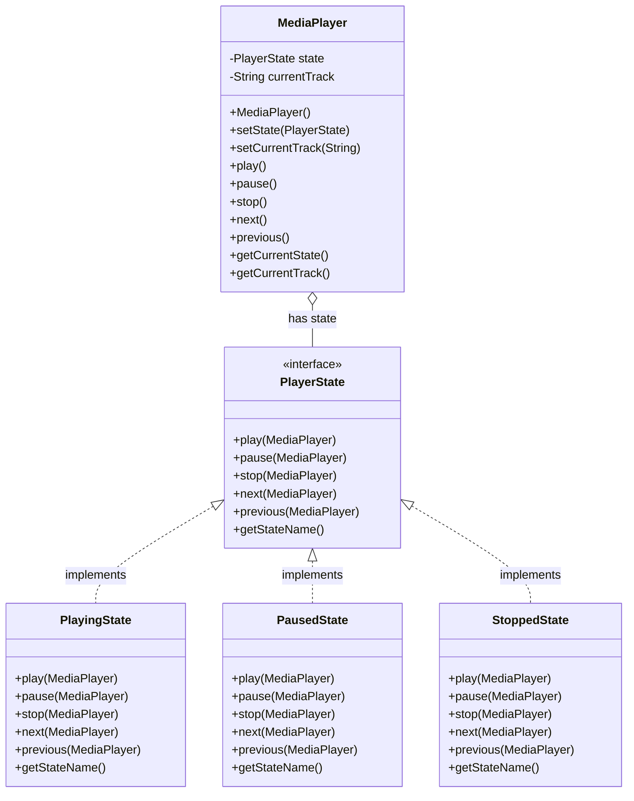

# State

## Diagrama

```mermaid
classDiagram
    class MediaPlayer {
        -PlayerState state
        -String currentTrack
        +MediaPlayer()
        +setState(PlayerState)
        +setCurrentTrack(String)
        +play()
        +pause()
        +stop()
        +next()
        +previous()
        +getCurrentState()
        +getCurrentTrack()
    }
    
    class PlayerState {
        <<interface>>
        +play(MediaPlayer)
        +pause(MediaPlayer)
        +stop(MediaPlayer)
        +next(MediaPlayer)
        +previous(MediaPlayer)
        +getStateName()
    }
    
    class PlayingState {
        +play(MediaPlayer)
        +pause(MediaPlayer)
        +stop(MediaPlayer)
        +next(MediaPlayer)
        +previous(MediaPlayer)
        +getStateName()
    }
    
    class PausedState {
        +play(MediaPlayer)
        +pause(MediaPlayer)
        +stop(MediaPlayer)
        +next(MediaPlayer)
        +previous(MediaPlayer)
        +getStateName()
    }
    
    class StoppedState {
        +play(MediaPlayer)
        +pause(MediaPlayer)
        +stop(MediaPlayer)
        +next(MediaPlayer)
        +previous(MediaPlayer)
        +getStateName()
    }
    
    MediaPlayer o-- PlayerState : has state
    PlayerState <|.. PlayingState : implements
    PlayerState <|.. PausedState : implements
    PlayerState <|.. StoppedState : implements
```
