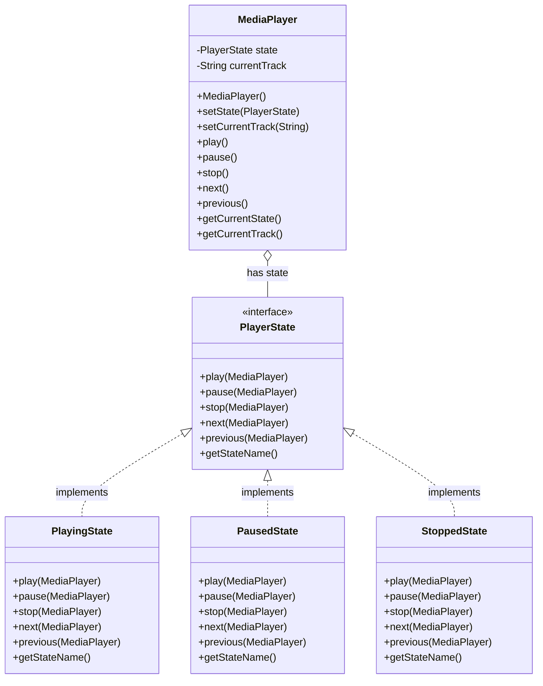

# State

## 📚 Exemplo de Padrão State: Media Player

Este projeto demonstra o uso do padrão de projeto **State** em Java, utilizando um Media Player como exemplo. O padrão State permite que um objeto altere seu comportamento quando seu estado interno muda, facilitando a manutenção e a extensão do código.

## Estrutura 🏗️

- `PlayerState`: Interface base para os estados do player.
- `PlayingState`, `PausedState`, `StoppedState`: Implementações concretas dos estados.
- `MediaPlayer`: Classe principal que mantém o estado atual e delega as ações.
- `MediaPlayerTest`: Testes unitários com exemplos de uso.

## Como funciona 🔍

O `MediaPlayer` muda seu comportamento (play, pause, stop, next, previous) de acordo com o estado atual:
- **PlayingState**: Executa a música e permite pausar, parar ou trocar de faixa.
- **PausedState**: Permite retomar a reprodução, parar ou trocar de faixa.
- **StoppedState**: Permite iniciar a reprodução de uma faixa.

Cada ação é delegada ao estado atual, que define o comportamento apropriado para aquele contexto.

## Exemplo de Uso

```java
MediaPlayer player = new MediaPlayer();
player.setCurrentTrack("Bohemian Rhapsody - Queen");
player.play();   // Estado muda para Playing
player.pause();  // Estado muda para Paused
player.stop();   // Estado muda para Stopped
```

## Diagrama


---

**Projeto acadêmico para demonstração do padrão State.**
